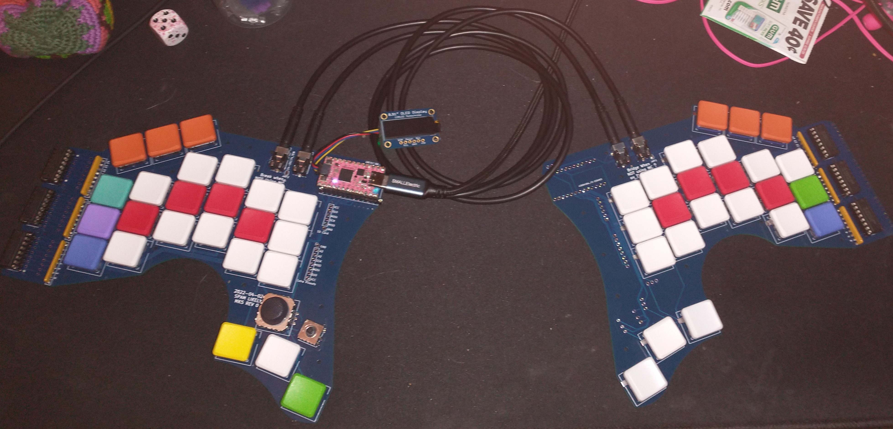

# SPAM-LIKELY
## What
Keyboard with full 104+ keycode support. This becomes my primary driver, and is adaptable in order to accomidate changes in workflow.

## Story

The Spam-Likely Split Keyboard Rev0 was designed as my first attempt at building a keyboard. In response to Ben Vallack (Later referred to as "Tom" in other areas of my writing and memory) and his youtube video entitled [“The REAL Ergonomic Keyboard Endgame!” - How To Design & Make A Totally Custom Keyboard](https://www.youtube.com/watch?v=UKfeJrRIcxw), I created a rough document with the design goals below. The project started with the [ergogen project](https://github.com/ergogen/ergogen), and quickly lead into using ki-cad and other new tools

In particular, I'm looking to have something that I can build and itterate on, and I want to be able to make modifications to, and use this as a tool to further learn how to use new modules over raw IO, SPI, UART, and I2C.

I chose the KB2040 for this board when I learned about the two peripheral interfaces I can activate over either SPI, UART, or I2C. This gives me sufficiant options to learn how different plugable modules might work, and the horsepower behind it seems underutilized for my purposes. 

In reviewing other designs, I knew that I didn't want to use a traditional diode matrix for the following reasons.
- diodes tend to be at or near the point of keystrike
- diodes are directional; they're electronic valves, so if I solder this by hand especially at night, there's a larger chance of creating new problems, and higher risk of failure on first time bootup
- the matrix takes up too many pins, and does not give enough space for experimentation
- the traditional grid-style matrix circuit design **did not bring me joy**

In this I started seeking alternatives. At one point I was at one point set on using the PCA9506 I2C GPIO expander, as referenced by Zach Freedman in his [Mirage project](https://github.com/ZackFreedman/MiRage). The lack of availaibility of the PCA9506, which includes built-in pull-up resistors, and the high cost of failure (and parts) lead me to search for alternatives again. A general IO expander over SPI seemed like the best bet, and I looked into Adafruit's MCP23017 expander board as a solution. These boards were at a shortage at the time, and I went back to discord boards to complain. 

Designer [Deshipu](https://github.com/deshipu) lead me to the idea of using shift registers as an alternative. The libraries were included by default with the keypad library in circuitpython, and wouldn't require that I use extra peripheral "slots" to drive the board. I found the specific model 74HC597E, which was availible from multiple manufacturers, could be driven by 3.3v or 5v, and was cheap. Allong with some network resistors, I started on the breadboard using the following design schematic referenced from [Nuts and Volts; November 2010](https://www.nutsvolts.com/magazine/article/november2010_smileysworkshop).	 

In addition to the features specified, other options were added including a 5 way switch for naviation, a thumbstick, and an I2C breakout header. These may change in future revisions.

## Design goals

We choose to go to the moon. We choose to go to the moon in this decade and do the other things, not because they are easy, but because they are hard, ... because that challenge is one that we are willing to accept, one we are unwilling to postpone, and one which we intend to win, and the others, too. -- JFK

### Practical (Ux)
- usable for **all** work and gaming tasks

### Keys:
- All keys can be reached from neutral position
- 1 distance from home for all normal operations
- Comfortable for normal workload /8 hours
- Allow adjustment to type with arms at shoulder width
- Use Kailh Choc keys and keycaps for a lower typing profile

### Display Hardware:
- Not limited by board
- TFT display
- OLED Display

### Firmware
- Layering to allow for symbols, special function modes
- Quick access to editing suite, arrow keys, tenkey on either hand
- Display to show keymaps
- Allow for mouse control
- Press shift to cap the next letter OSM(KC_LSFT)
- Double tap shift to toggle caps
- Key combo for print screen
- Key combo to toggle scroll lock
- Quick access to editing suite + shift
- DF(layer) - Change default layer

### Hardware
- Allow for Hardware add-ons / prototype space
- ~~Communication over i2c~~
- No small / difficult soldering.
- No matrix
- No need for diodes
- ~Use IO Expanders for additional Modules (PCA9505)~
- Board is flipable -- one board can be used for left or right hand
- Socket parts (I should be able to swap out everything, including expander IO chips, keyswitches, and the main driving MC)
- Use Shift Registers for standard IO
- Firmware can be updated without flashing the board
- Break out all unused pins

### Layers:
- 14 - Piano / midi 
- 12 - Macros
- 8 - Game specific keyboard
- 5 - Mouse Control
- 4 - Editing suite
- 3 - Number pad ~~+ F keys~~
- 1 - (Symbols)
- 0 - Typing layer

### Design Options:
- Sockets for IO Expanders
- Wireless Conversion available
- Modular, to allow new components using the same standard onto the board
- PS2 Output
- Onboard Storage / SD Card via add-on
- Case to house the board
- Tenting options
